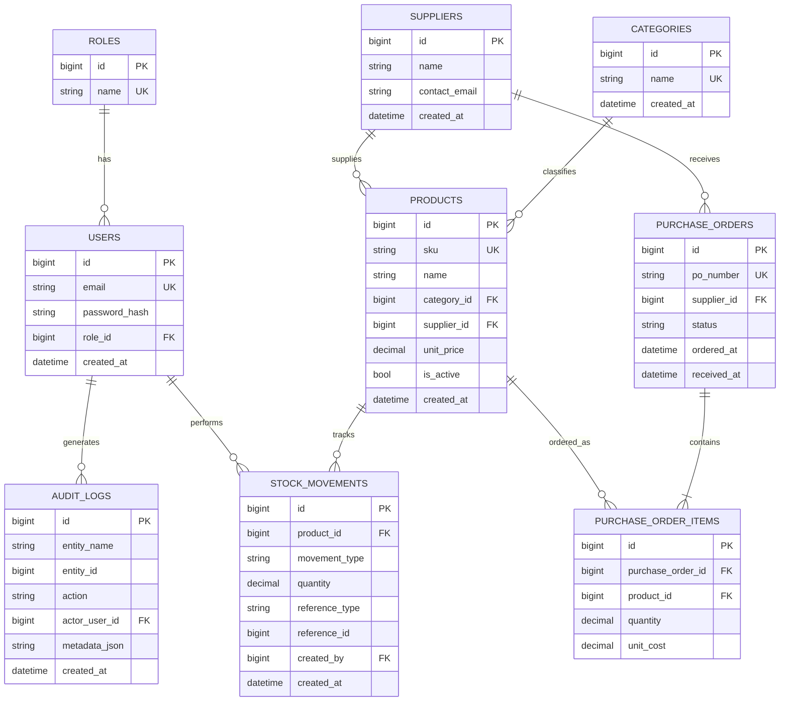

# Software Design Document (SDD)

## 1. Vision and Scope

### Vision
Build a reliable, secure, and maintainable inventory management platform that helps teams manage products, suppliers, stock movements, and purchasing workflows through a modern web application.

### In Scope (Initial Releases)
- Authentication and role-based access.
- Product, category, and supplier management.
- Stock movement tracking (inbound, outbound, adjustment).
- Purchase order lifecycle and receiving.
- Audit logs for critical business operations.

### Out of Scope (Initial Releases)
- Native mobile applications.
- Multi-warehouse optimization and forecasting.
- External marketplace integrations.
- Advanced BI dashboards beyond operational reporting.

## 2. Functional Requirements

### FR-001 Authentication and Session
- Users can sign in with valid credentials.
- Users can sign out and invalidate active refresh tokens.
- Protected endpoints reject unauthenticated requests.

### FR-002 Authorization
- The system enforces role-based permissions by endpoint and operation.
- Unauthorized operations return forbidden responses.

### FR-003 Product Management
- Users can create, read, update, and archive products.
- Products belong to categories and can be linked to suppliers.
- Product SKU must be unique.

### FR-004 Category Management
- Users can create and list categories.
- Categories can be associated with products.

### FR-005 Supplier Management
- Users can create and list suppliers.
- Suppliers can be associated with products and purchase orders.

### FR-006 Stock Movements
- Users can create inbound, outbound, and adjustment movements.
- System updates stock balance atomically.
- Movement history is immutable and queryable.

### FR-007 Purchase Orders
- Users can create purchase orders with line items.
- Purchase orders support status transitions: Draft, Submitted, Received, Canceled.
- Receiving a purchase order updates stock.

### FR-008 Auditing
- Critical domain actions are logged with actor, timestamp, and payload summary.
- Audit records can be queried by date and entity.

### FR-009 API and UI Consistency
- API returns consistent success and error payload structures.
- Angular UI provides form validation and clear user feedback.

## 3. Non-Functional Requirements

### NFR-001 Performance
- P95 API response time under 300 ms for standard read endpoints in non-production baseline load.
- P95 API response time under 700 ms for complex filtered list endpoints.

### NFR-002 Availability and Reliability
- Health endpoint available at all times when service is running.
- Critical write operations are transactional to prevent partial updates.

### NFR-003 Security
- Credentials and secrets must never be committed to source control.
- Authentication tokens must be validated on every protected request.
- Input validation is mandatory for all command endpoints.

### NFR-004 Maintainability
- Enforce clean architecture boundaries between Domain, Application, Infrastructure, and API.
- Keep business rules in domain/application layers.

### NFR-005 Observability
- Structured logs include correlation and trace identifiers.
- Error handling uses centralized middleware with consistent responses.

### NFR-006 Testability
- Unit tests for domain and application logic.
- Integration tests for API and persistence behavior.

## 4. Architecture Decisions

### AD-001 Backend Architecture
- Pattern: Clean architecture with layered projects.
- Rationale: Testability, separation of concerns, and long-term maintainability.

### AD-002 Monorepo Layout
- Pattern: Single repository for backend, frontend, and tests.
- Rationale: Coordinated change management and unified project onboarding.

### AD-003 Data Access
- Pattern: EF Core with MySQL and explicit entity configuration.
- Rationale: Migration support and productivity with strong ORM ecosystem.

### AD-004 Error Handling
- Pattern: Global exception middleware.
- Rationale: Uniform error responses and easier operational troubleshooting.

### AD-005 API Contract Discipline
- Pattern: Resource-oriented endpoints and standardized response semantics.
- Rationale: Predictable integration behavior and easier frontend consumption.

## 5. Database Design (ERD)

### Core Entities
- Users
- Roles
- Products
- Categories
- Suppliers
- StockMovements
- PurchaseOrders
- PurchaseOrderItems
- AuditLogs

### ERD

### Data Rules
- Product SKU is unique.
- Purchase order number is unique.
- Stock movement records are append-only.
- Domain constraints must prevent invalid stock transitions.

## 6. API Specification

### Base and Conventions
- Base URL: /api
- Payload format: JSON with camelCase properties.
- Date/time: ISO 8601 UTC.

### Standard Response Shape
Success response:
- data: object or array
- meta: optional paging or operation metadata

Error response:
- traceId: request correlation id
- code: stable machine-readable code
- message: summary for the client
- details: optional validation errors

### Authentication Endpoints
- POST /api/auth/login
  - Request: email, password
  - Response: accessToken, refreshToken, expiresIn
- POST /api/auth/refresh
  - Request: refreshToken
  - Response: accessToken, refreshToken, expiresIn
- POST /api/auth/logout
  - Request: refreshToken
  - Response: 204 No Content

### Product Endpoints
- GET /api/products?page=1&pageSize=20&sortBy=name&direction=asc
- GET /api/products/{id}
- POST /api/products
- PUT /api/products/{id}
- DELETE /api/products/{id}

### Category Endpoints
- GET /api/categories
- POST /api/categories

### Supplier Endpoints
- GET /api/suppliers
- POST /api/suppliers

### Stock Movement Endpoints
- GET /api/stock-movements?page=1&pageSize=20
- POST /api/stock-movements

### Purchase Order Endpoints
- GET /api/purchase-orders
- GET /api/purchase-orders/{id}
- POST /api/purchase-orders
- PUT /api/purchase-orders/{id}/submit
- PUT /api/purchase-orders/{id}/receive
- PUT /api/purchase-orders/{id}/cancel

### Status Code Policy
- 200, 201, 204 for success.
- 400, 401, 403, 404, 409 for client-side failures.
- 500 for unhandled server errors.

## 7. Angular Application Structure

### Target Structure
- src/frontend/src/app
  - core
    - services
    - interceptors
    - guards
    - state
  - shared
    - components
    - directives
    - pipes
    - models
  - features
    - auth
    - dashboard
    - products
    - categories
    - suppliers
    - stock-movements
    - purchase-orders
    - audit-logs
  - layouts
    - main-layout
    - auth-layout

### UI Architecture Guidelines
- Standalone Angular components where practical.
- Feature-first organization with lazy loading for feature routes.
- API integration through typed services in core/services.
- Route protection through guards and role policies.
- Shared UI primitives in shared/components.

### State Strategy
- Keep local component state by default.
- Introduce shared state only for cross-feature concerns (session, global filters, notifications).

## 8. Coding Standards

### General
- Use meaningful names for domain concepts.
- Keep methods small and focused.
- Avoid duplicated business logic across layers.

### Backend (.NET)
- Use nullable reference types and explicit validation.
- Keep controllers thin; orchestration belongs in Application.
- Use async I/O and CancellationToken in service/repository methods.
- Prefer domain-specific exceptions and centralized exception mapping.

### Frontend (Angular/TypeScript)
- Enable strict TypeScript mode.
- Prefer immutable update patterns for state.
- Keep templates simple and move logic to component/service classes.
- Use linting and formatting consistently.

### Testing
- Unit tests for domain logic and validators.
- Integration tests for API endpoints and DB interactions.
- UI tests for critical user flows as features mature.

## 9. Git Workflow

### Branching Strategy
- main: production-ready branch.
- develop: integration branch for upcoming release.
- feature/*: short-lived branches for feature work.
- hotfix/*: urgent production fixes.

### Commit and PR Standards
- Conventional commit prefixes: feat, fix, docs, refactor, test, chore.
- Keep commits atomic and focused.
- PRs must include summary, scope, and verification steps.
- Require at least one review and passing CI checks before merge.

### Merge Policy
- Prefer squash merge for feature branches to keep history concise.
- Rebase feature branches on develop before opening PR when needed.

## 10. Milestones and Acceptance Criteria

### Milestone 0 Foundation (Completed)
Acceptance criteria:
- Backend and frontend projects build successfully.
- Health endpoint available.
- Database connectivity and migration baseline established.

### Milestone 1 Identity and Access
Acceptance criteria:
- Login, refresh, and logout endpoints implemented and tested.
- Protected routes enforce authentication and authorization.
- Angular auth flow and guarded routes functional end-to-end.

### Milestone 2 Catalog Management
Acceptance criteria:
- Product/category/supplier CRUD APIs complete.
- Validation and error contract coverage in tests.
- Angular catalog screens support create, edit, list, archive.

### Milestone 3 Stock Movements
Acceptance criteria:
- Movement creation updates balances transactionally.
- Movement history and filtering available in API and UI.
- Stock integrity tests pass for edge scenarios.

### Milestone 4 Purchase Orders
Acceptance criteria:
- Purchase order lifecycle transitions implemented.
- Receiving updates stock and creates audit trail.
- End-to-end workflow from PO to inventory update validated.

### Milestone 5 Audit and Observability
Acceptance criteria:
- Audit log capture enabled for critical actions.
- Structured logging with trace correlation implemented.
- Runtime health and diagnostics baseline documented.

### Milestone 6 Release Hardening
Acceptance criteria:
- CI quality gates enforce build and test pass.
- Performance baseline measured and key regressions addressed.
- Deployment and rollback runbooks completed.

## Traceability Matrix (Initial)
- FR-001 and FR-002 map to Milestone 1.
- FR-003, FR-004, FR-005 map to Milestone 2.
- FR-006 maps to Milestone 3.
- FR-007 maps to Milestone 4.
- FR-008 maps to Milestone 5.
- NFR requirements apply across all milestones and must be validated continuously.
